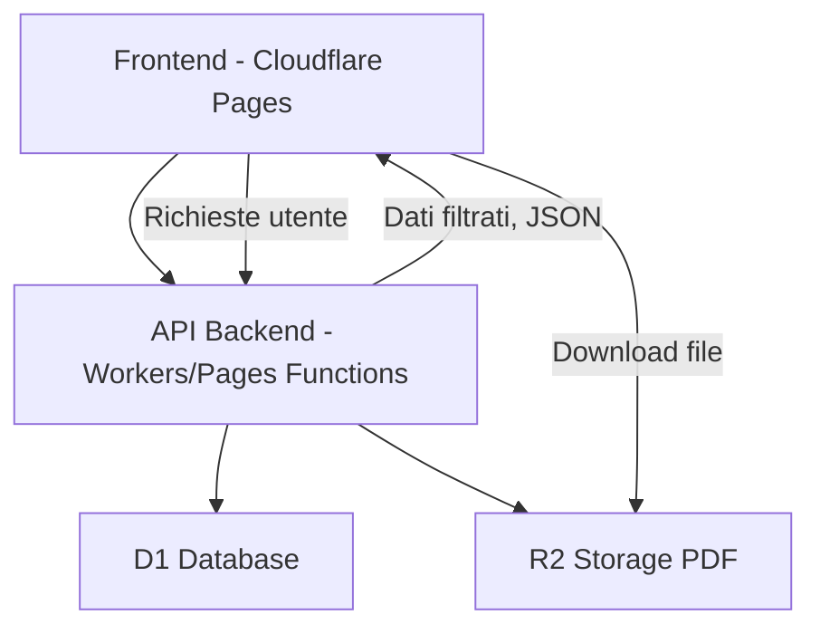
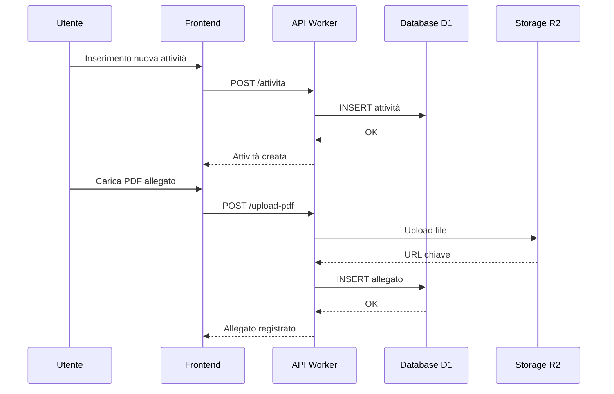
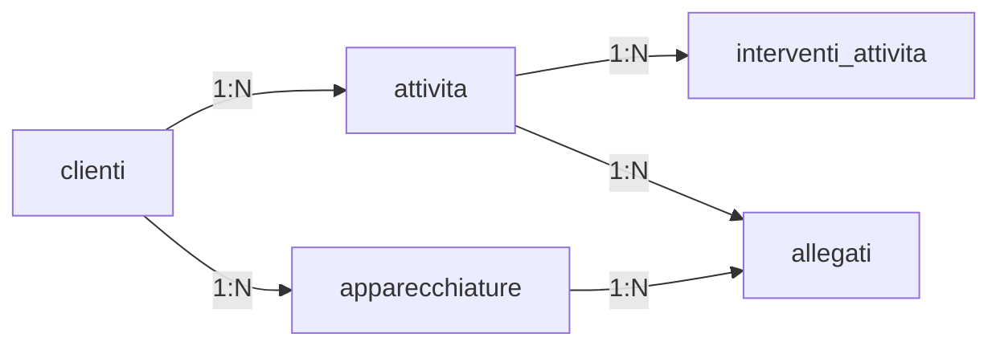

# Documento tecnico dell'applicazione

## 1. Obiettivo dell'applicazione
L'applicazione nasce per sostituire un file Excel utilizzato per la gestione di attività giornaliere, apparecchiature e relativi documenti allegati (PDF). L'obiettivo è creare un sistema centralizzato che permetta:
- Inserimento e consultazione delle attività giornaliere.
- Gestione completa delle apparecchiature e dei loro test.
- Archiviazione e download di documenti PDF.
- Filtri avanzati su tutti i campi principali.
- Storico interventi legati a ogni attività.
- Accesso da qualsiasi dispositivo grazie a frontend web.


---

## 2. Architettura generale
L'applicazione verrà sviluppata interamente nell'ecosistema Cloudflare sfruttando i suoi servizi serverless.

### 2.1 Componenti principali
- **Cloudflare Pages**: ospita il frontend (React/Vue/Vanilla JS).
- **Cloudflare Workers / Pages Functions**: backend serverless per API REST.
- **Cloudflare D1**: database SQL relazionale (SQLite su Cloudflare).
- **Cloudflare R2**: storage per PDF e file allegati.

### 2.2 Flusso di funzionamento
1. L'utente accede al frontend (su Pages).
2. Il frontend invia richieste API ai Workers.
3. I Workers interagiscono con:
   - **D1** per leggere/scrivere dati.
   - **R2** per caricare o recuperare file PDF.
4. I dati filtrati o i file vengono restituiti al frontend.

### 2.3 Vantaggi dell'architettura
- Scalabile senza gestione server.
- Costi bassissimi (gran parte gratuita).
- Performance elevate grazie all'esecuzione edge.
- Storage PDF affidabile e conveniente.


---

## 3. Funzionalità dell'applicazione

### 3.1 Gestione attività giornaliere
Ogni attività contiene:
- Cliente
- Modello
- Seriale
- Codice inventario cliente
- Modalità apertura richiesta
- Data apertura richiesta
- Numero preventivo + PDF allegato
- Data preventivo
- Numero accettazione + PDF allegato
- Data accettazione
- Interventi effettuati (storico)
- Stato (aperta/chiusa/riaperta)

#### Operazioni supportate
- Creazione attività
- Visualizzazione elenco attività
- Filtri combinati (cliente, stato, date, modello, seriale, ecc.)
- Gestione interventi
- Upload e download PDF collegati
- Chiusura/ripertura attività

### 3.2 Gestione apparecchiature
Ogni apparecchiatura contiene:
- Cliente
- Modello apparecchiatura
- Seriale (opzionale)
- Data test funzionali
- Data test elettrici
- Allegati PDF multipli

#### Operazioni supportate
- Inserimento apparecchiatura
- Ricerca/applicazione filtri
- Gestione test
- Upload/download PDF

### 3.3 Allegati PDF
Caratteristiche:
- Possibilità di allegare uno o più documenti a ogni elemento.
- Download tramite link firmati da Workers.
- Salvataggio metadata in D1.


---

## 4. API dell'applicazione

### 4.1 Endpoints principali
- **POST /attivita** – Crea una nuova attività.
- **GET /attivita** – Lista filtrata delle attività.
- **GET /attivita/:id** – Dettaglio attività.
- **POST /attivita/:id/interventi** – Aggiunge un intervento.
- **GET /attivita/:id/interventi** – Lista degli interventi.
- **POST /apparecchiature** – Crea una nuova apparecchiatura.
- **GET /apparecchiature** – Lista filtrata.
- **POST /upload-pdf** – Carica un file su R2.
- **GET /download-pdf/:id** – Scarica PDF.

Ogni API risponde in JSON.


---

## 5. Schema database (D1)
Di seguito lo schema relazionale completo.

### 5.1 Tabella `clienti`
```
CREATE TABLE clienti (
  id INTEGER PRIMARY KEY AUTOINCREMENT,
  nome TEXT NOT NULL,
  indirizzo TEXT,
  contatti TEXT
);
```

### 5.2 Tabella `attivita`
```
CREATE TABLE attivita (
  id INTEGER PRIMARY KEY AUTOINCREMENT,
  id_cliente INTEGER NOT NULL,
  modello TEXT,
  seriale TEXT,
  codice_inventario_cliente TEXT,
  modalita_apertura_richiesta TEXT,
  data_apertura_richiesta TEXT,
  numero_preventivo TEXT,
  data_preventivo TEXT,
  numero_accettazione_preventivo TEXT,
  data_accettazione_preventivo TEXT,
  stato TEXT NOT NULL DEFAULT 'APERTO',
  data_chiusura TEXT,
  note_generali TEXT,
  FOREIGN KEY(id_cliente) REFERENCES clienti(id)
);
```

### 5.3 Tabella `interventi_attivita`
```
CREATE TABLE interventi_attivita (
  id INTEGER PRIMARY KEY AUTOINCREMENT,
  id_attivita INTEGER NOT NULL,
  data_intervento TEXT NOT NULL,
  descrizione_intervento TEXT,
  operatore TEXT,
  FOREIGN KEY(id_attivita) REFERENCES attivita(id)
);
```

### 5.4 Tabella `apparecchiature`
```
CREATE TABLE apparecchiature (
  id INTEGER PRIMARY KEY AUTOINCREMENT,
  id_cliente INTEGER NOT NULL,
  modello TEXT NOT NULL,
  seriale TEXT,
  data_test_funzionali TEXT,
  data_test_elettrici TEXT,
  note TEXT,
  FOREIGN KEY(id_cliente) REFERENCES clienti(id)
);
```

### 5.5 Tabella `allegati`
```
CREATE TABLE allegati (
  id INTEGER PRIMARY KEY AUTOINCREMENT,
  tipo_riferimento TEXT NOT NULL,
  id_riferimento INTEGER NOT NULL,
  nome_file_originale TEXT NOT NULL,
  chiave_r2 TEXT NOT NULL,
  data_caricamento TEXT NOT NULL,
  note TEXT
);
```


---

## 6. Storage file (R2)
Ogni PDF viene memorizzato con:
- Cartella logica (es. `attivita/ID/filename.pdf`)
- Chiave salvata nella tabella `allegati`.

Il Worker genera URL firmati per il download.


---

## 7. Sicurezza e autenticazione
Consigliati:
- Login con JWT.
- Ruoli (es. admin/tecnico).
- Validazione dati lato API.
- Controllo ACL sugli allegati.

---

## 8. Considerazioni finali
Questa architettura offre:
- Zero gestione server.
- Scalabilità automatica.
- Costi bassissimi.
- Struttura solida per allegati e filtri complessi.

Pronta per essere implementata su Cloudflare in modo efficiente e mantenibile.


---

## 9. Descrizione estesa dell'applicazione

### 9.1 Panoramica generale
L'applicazione è progettata per essere uno strumento completo di gestione operativa. Sostituisce pienamente i fogli Excel e introduce un'interfaccia moderna, un sistema centralizzato e un archivio affidabile dei documenti. L'utente può registrare attività giornaliere, tracciare interventi, memorizzare test elettrici/funzionali delle apparecchiature e archiviare allegati in modo ordinato.

Il tutto è accessibile da qualsiasi dispositivo, senza necessità di installazioni locali.

### 9.2 Flusso utente (esperienza d'uso)

1. **Accesso / Login**
   L'utente entra nell'applicazione tramite un sistema di login. Una volta autenticato, viene presentata la dashboard.

2. **Dashboard iniziale**
   Presenta due pulsanti principali:
   - “Inserisci attività giornaliera”
   - “Gestisci apparecchiature”
   Possono essere aggiunti grafici di sintesi o indicatori (attività aperte, interventi recenti...).

3. **Inserimento di una nuova attività**
   L’utente compila un modulo con i campi richiesti:
   - Dati cliente
   - Informazioni sul dispositivo (modello/seriale/etc.)
   - Dettagli apertura richiesta
   - Informazioni preventivo
   - Informazioni accettazione
   L'utente può allegare subito PDF (preventivi, accettazioni) oppure farlo in un secondo momento.

4. **Gestione attività già registrate**
   Una lista mostra tutte le attività registrate. È possibile filtrare con più criteri contemporaneamente:
   - Cliente
   - Stato
   - Intervallo date apertura
   - Modello
   - Seriale
   - Codice inventario
   - Presenza documenti

   L'utente può:
   - Aprire un'attività
   - Modificarne i dati
   - Caricare nuovi PDF
   - Consultare e scaricare quelli esistenti
   - Aggiungere interventi
   - Chiudere o riaprire la richiesta

5. **Gestione interventi**
   Ogni attività può avere molti interventi registrati nel tempo. Ogni intervento ha:
   - Data
   - Descrizione dettagliata
   - Operatore che l'ha effettuato

   Lo storico interventi è visibile in forma di timeline.

6. **Gestione delle apparecchiature**
   Simile al modulo attività, ma focalizzato sui test.

   Per ogni apparecchiatura sono registrati:
   - Cliente
   - Modello
   - Seriale
   - Data test elettrici
   - Data test funzionali

   Ogni elemento può avere PDF allegati (certificazioni, risultati test, foto).

7. **Download e consultazione documenti**
   Tutti i PDF vengono salvati su R2. L'utente vede:
   - Nome file
   - Data caricamento
   - Pulsante “Scarica”

   Il download è gestito dal backend tramite URL firmati.

### 9.3 Logiche backend avanzate

- **Validazione campi**: Il backend assicura che i dati siano consistenti (es. date valide, formati corretti, campi obbligatori).
- **Gestione stati attività**: L'attività torna APERTA se vengono aggiunti nuovi interventi dopo la chiusura (se previsto).
- **Controllo integrità relazionale**: Non è possibile eliminare un cliente se ha attività o apparecchiature collegate.
- **Gestione storage PDF**: I Worker ricevono il file, generano un nome univoco, lo caricano su R2, e salvano metadati su D1.

### 9.4 UI/UX dettagliata

#### Lista attività
- Tabella dinamica con colonne ordinabili.
- Filtri live.
- Badge colorati per lo stato: verde (chiusa), rosso (aperta), giallo (in attesa).
- Icone per indicare la presenza di allegati.

#### Dettaglio attività
- Scheda riepilogativa dati principali.
- Sezione interventi in timeline verticale.
- Lista allegati con anteprima nome.
- Pulsanti per scaricare, aggiungere e rimuovere allegati.

#### Inserimento apparecchiature
- Modulo semplice e rapido.
- Possibilità di aggiungere uno o più test alla volta.

### 9.5 Scalabilità e manutenzione

- La struttura serverless riduce la necessità di manutenzione.
- D1 è adatto al carico di una piccola/medio app.
- R2 permette di archiviare migliaia di PDF con costi minimi.
- I Workers possono essere aggiornati istantaneamente senza downtime.


---

## 9.6 Diagrammi architetturali

### 9.6.1 Architettura generale dell'applicazione


### 9.6.2 Flusso gestione attività


### 9.6.3 Struttura logica del database


## 10. Estensioni future possibili

- Report PDF automatici delle attività o dei test.
- Dashboard analitica con grafici filtrabili.
- Integrazione con dispositivi mobili per caricare foto.
- Notifiche email automatiche su cambi stato.
- Possibilità di esportare in Excel/CSV.


